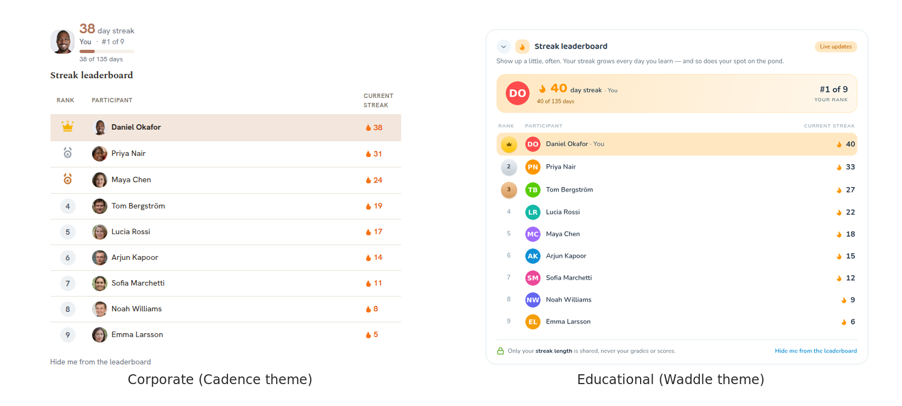
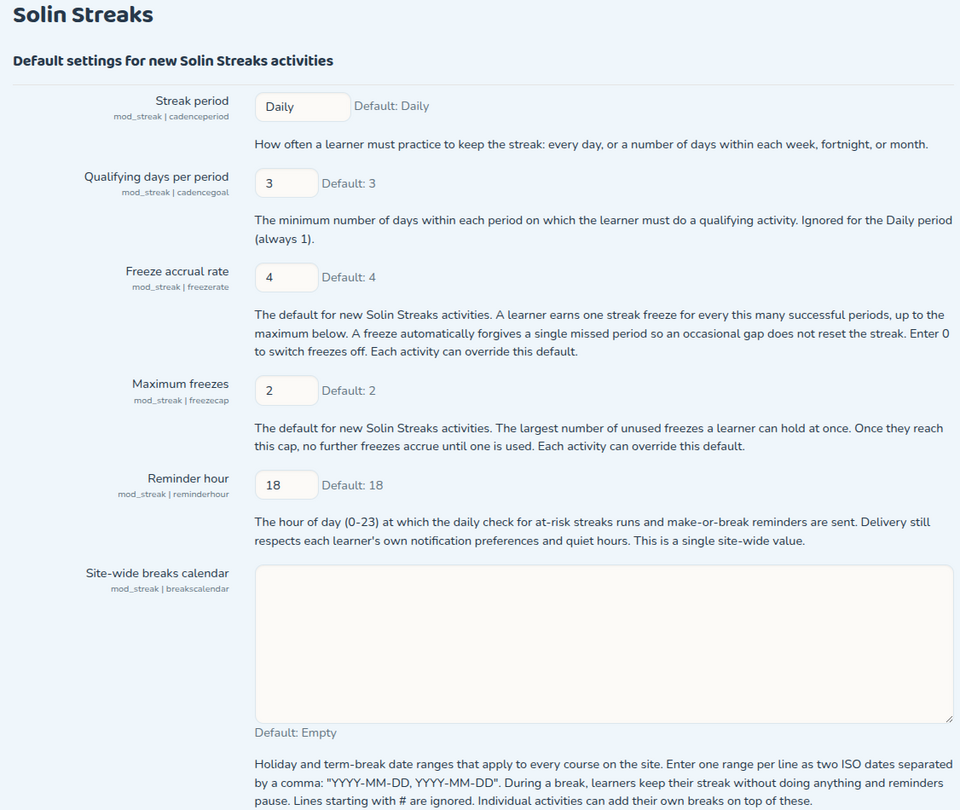
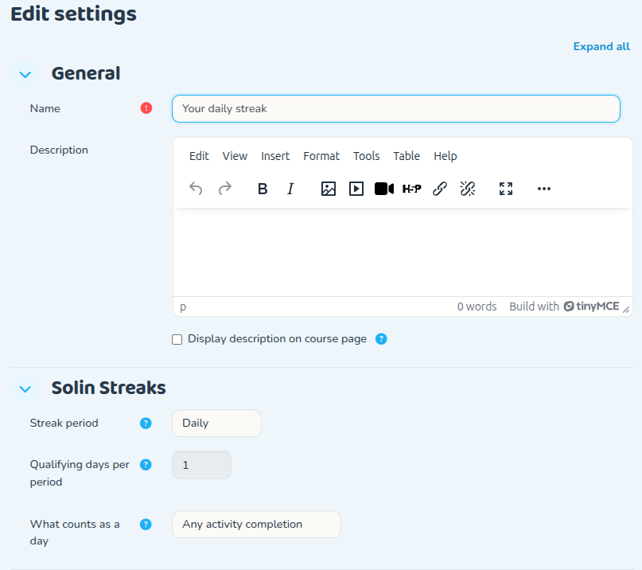

# Solin Streaks (mod_streak)

Solin Streaks adds a daily-practice learning streak to any Moodle course. Each learner
gets a personal streak counter that grows every day (or week) they do a qualifying
activity, a streak "freeze" that forgives the occasional missed day, gentle
make-or-break reminders, and a friendly per-course leaderboard. It turns "I should
keep up with this course" into a visible, rewarding habit, and gives whoever runs the
course an at-a-glance picture of who is showing up consistently.

The streak and the leaderboard render **inline on the course page** (there is no
separate page to visit) and the plugin ships **no JavaScript**: everything is
server-rendered HTML and CSS, themeable through templates and CSS tokens.

Because every visual decision lives in the theme, the same plugin suits very different
audiences: corporate compliance, onboarding, and L&D programs as readily as schools,
universities, and language learning. The two leaderboards below are the **identical
activity** — a corporate theme (Cadence) on the left, a playful educational theme
(Waddle) on the right.



**Version:** 0.1.0 (alpha) · **Updated:** 2026-06-29 · **Maintainer:** Solin (Onno Schuit)

## Compatibility

The same plugin code runs unchanged on Moodle 4.5 LTS through 5.2. Pick the branch that
matches your Moodle version:

| Moodle | PHP | Plugin path | Branch |
|--------|-----|-------------|--------|
| 5.2 | 8.3+ | `public/mod/streak` | `MOODLE_502_STABLE` |
| 5.1 | 8.2+ | `public/mod/streak` | `MOODLE_501_STABLE` |
| 5.0 | 8.2+ | `mod/streak` | `main` |
| 4.5 LTS | 8.1+ | `mod/streak` | `main` |

Any database supported by your Moodle version works (MySQL / MariaDB / PostgreSQL); the
plugin uses only the portable Moodle DML API. Moodle 5.1 moved the web root into a
`public/` directory (4.5 and 5.0 still use the classic root layout), which is the only
reason the install path differs between versions. All four are tested with the same code.

## What it does

- **Per-learner streak counter.** Current streak plus personal best, shown with the
  branded flame on the course page.
- **Configurable cadence.** Daily by default, or Weekly / Fortnightly / Monthly with a
  per-period goal ("3 of 7 days this week"), so the streak fits the course rhythm.
- **Streak freeze.** A configurable number of forgiven misses per period (with a cap),
  so one bad day does not wipe out weeks of effort.
- **Make-or-break reminders.** Delivered through Moodle's Message API (email, web
  notification, and mobile push where available), only when a streak is actually at
  risk, and respecting each user's notification preferences.
- **Per-course leaderboard.** Course participants ranked by current streak, with
  photo or coloured-initials avatars and top-three medals. Ranking is privacy-aware:
  any learner can **opt out** and is then removed from everyone else's view while still
  seeing their own private counter.
- **Streak lifecycle / end date.** Use the course end date, a custom end date, or run
  evergreen. At the end date the leaderboard freezes into a final standing ("You
  finished with a 42-day streak, rank #3 of 60") instead of vanishing.
- **Qualifying action.** By default any activity completion counts toward the day; the
  qualifying mode is configurable per activity.
- **Institutional breaks.** A site holiday calendar so scheduled closures do not break
  anyone's streak.
- **Themeable and mobile-ready.** Override templates, pix icons, CSS tokens, or the
  renderer without forking; the activity also renders in the Moodle App.

## How a streak works

A learner earns one **qualifying day** for each calendar day (in their own timezone) on
which they perform a qualifying action. Consecutive qualifying periods build the streak;
a missed period ends it unless a freeze is available. The number shown at the top of the
widget and the number on the leaderboard are always the same value (the cached
`displaystreak`), so what a learner sees about themselves and where they sit on the board
never disagree.

## Installation

**Via the admin UI (recommended):** download the ZIP for your Moodle version, then go to
*Site administration → Plugins → Install plugins*, upload the ZIP, and follow the upgrade
prompts.

**Via Git:** clone the branch that matches your Moodle version into the module directory.

```bash
# Moodle 5.x (public/ layout)
cd /path/to/moodle/public/mod
git clone -b MOODLE_502_STABLE https://github.com/solin-repo/moodle-mod_streak.git streak

# Moodle 4.5 LTS
cd /path/to/moodle/mod
git clone -b main https://github.com/solin-repo/moodle-mod_streak.git streak
```

Then finish the install from *Site administration → Notifications*, or on the command
line:

```bash
php admin/cli/upgrade.php --non-interactive
php admin/cli/purge_caches.php
```

This creates the plugin's three database tables and registers its scheduled task.

## Using it

A teacher (or anyone with `mod/streak:addinstance`) adds **one** Solin Streaks activity
to a course, like any other activity. There is intentionally a single instance per
course: it represents that course's streak. The streak counter and leaderboard then
appear inline on the course page for every enrolled user. Learners need do nothing to
opt in; they simply keep doing the course, and may hide themselves from the leaderboard
at any time from the widget.

## Configuration

**Site defaults** (*Site administration → Plugins → Activity modules → Solin Streaks*):

| Setting | Purpose |
|---------|---------|
| `cadenceperiod` | Default period (Daily / Weekly / Fortnightly / Monthly) for new activities. |
| `cadencegoal` | Default minimum qualifying days per period. |
| `freezerate` | How often a freeze is granted (e.g. one per four successful periods). |
| `freezecap` | Maximum freezes a learner can bank. |
| `reminderhour` | Hour of day reminders are sent. |
| Breaks calendar | Site-wide holiday ranges that never break a streak. |



**Per-activity settings** (on the activity's settings form) let a teacher override the
cadence and goal, choose the qualifying action, set the end-date mode (course end /
custom / evergreen), tune the freeze policy and reward, and exclude staff or specific
roles from the leaderboard.



## Capabilities

| Capability | Default roles | Allows |
|------------|---------------|--------|
| `mod/streak:addinstance` | editingteacher, manager | Add and configure the activity in a course. |
| `mod/streak:view` | student, teacher, editingteacher, manager | See the inline streak widget. |
| `mod/streak:viewleaderboard` | student, teacher, editingteacher, manager | See the per-course leaderboard. |

## Leaderboard scope

The free plugin's leaderboard is **per-course by design**: it ranks a course's own
members by their streak in that course, which keeps it coherent and privacy-respecting.
Cross-course, cohort, and site-wide streak aggregation (institution-facing dashboards)
are intentionally out of scope for the free plugin.

## Privacy and data

All processing happens inside your Moodle; nothing is sent to any external service. The
plugin stores three tables:

| Table | Contents |
|-------|----------|
| `streak` | Per-activity configuration (cadence, goal, freeze policy, end date, …). |
| `streak_state` | Per-user streak state (current and longest streak, freezes, opt-out, …). |
| `streak_day` | The per-user ledger of qualifying days. |

A full Privacy API provider is implemented: a user's streak data can be exported and
deleted, individually or in bulk, including the userlist (bulk) requests.

## Theming

The widget is a templatable renderable that returns pure data, so every visual decision
lives in the templates and CSS. A theme can override, in increasing order of effort:
the CSS tokens (`--streak-*` custom properties), the pix icons (the flame and medals),
the Mustache templates (`mod_streak/widget`, `mod_streak/avatar`), or the plugin
renderer. No plugin changes are needed to restyle the streak or the board.

This is what lets the same streak serve a corporate intranet and a classroom equally
well: the two themes shown at the top of this page (Cadence and Waddle) are the same
activity with different CSS tokens, pix icons, and templates — the plugin code is
identical in both.

The two themes are full Moodle experiences, not just a restyled widget. The same streak
mechanics sit inside each — a warm, restrained corporate look (Cadence) and a playful,
game-like educational look (Waddle), shown below as both the logged-in dashboard
and the guest homepage:


## Testing

The plugin ships a full automated test suite: **62 PHPUnit tests** covering the streak
engine, cadence, evaluator, leaderboard, reminders, backup/restore, privacy, and the
output classes, plus **3 Behat scenarios** for the inline display, leaderboard opt-out,
and the one-activity-per-course rule. All pass on Moodle 4.5, 5.1, and 5.2.

```bash
php admin/tool/phpunit/cli/init.php
vendor/bin/phpunit --testsuite mod_streak_testsuite
```

## Requirements

- Moodle and PHP versions per the compatibility table above.
- A working `cron` (the streak roll-over, lifecycle freezing, and reminders run from a
  scheduled task).

## License and credits

Copyright © Solin (Onno Schuit) and contributors, https://solin.co

Licensed under the GNU General Public License v3 or later. See
<https://www.gnu.org/licenses/>.
